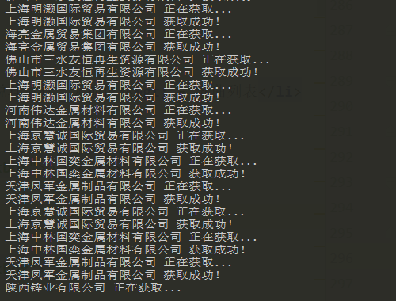
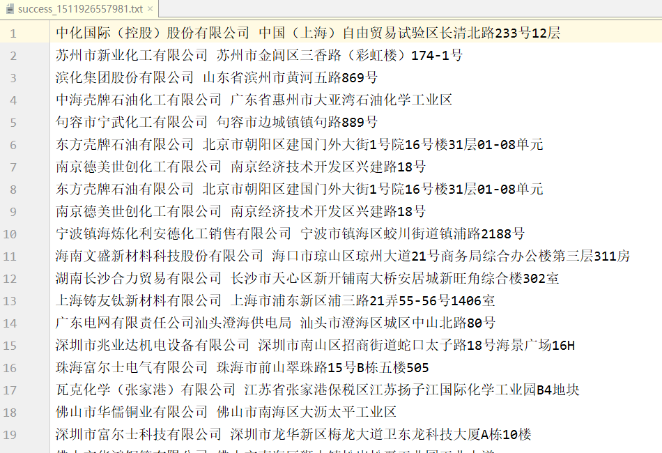

## 天眼查

* 爬取公司地址信息

### 依赖

* [HtmlUnit](http://htmlunit.sourceforge.net/)

### 使用方法

**请确保文件全部使用 utf-8 编码格式！**

```bash
java -jar tianyancha.jar -t [old_filename] [new_filename]  将公司名转换成一行一个
java -jar tianyancha.jar -g [filename]                     获取公司信息
```

### 效果截图

* 运行截图



* 生成文件



### 作者

* [StarUDream](https://github.com/StarUDream) 

### 协议

* [MIT](https://en.wikipedia.org/wiki/MIT_License)
